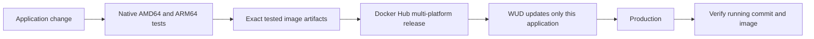

# IS 373: application delivery

The homepage displays **“The test website is working.”** for xenoshin.com. The existing calculator is available at `/calculator`.

A small FastAPI calculator makes a tested release visible: the browser calculates in JavaScript, verifies through Python, and reports the running commit. Learn to test, build, publish, deploy, and roll back one application.

This repository owns **application code and delivery**. Its companion, [373_hosting](https://github.com/kaw393939/373_hosting), owns **Ubuntu, Docker installation, DNS, Traefik, and public HTTPS**. Each works independently; together they provide the complete course.

| Your goal | Start here |
|---|---|
| Run the calculator locally | Quick start below |
| Learn unit, integration, and browser testing | [Testing](docs/testing.md) |
| Understand tested multi-platform releases | [CI/CD](docs/ci-cd.md) |
| Put the published application behind HTTPS | [Hosting handoff](docs/hosting.md) |
| Rehearse failed tests and rollback | [Demo runbook](docs/demo.md) |
| Change the project | [Contributing](CONTRIBUTING.md) and [specification](docs/spec.md) |
| Inspect previous demonstrations | [Evidence](docs/evidence.md) and [QA](docs/qa.md) |

## Quick start: local development

Prerequisites: Docker with Linux containers, Git, `make`, and a bootstrap Python 3 with pip. Python 3.13.15, uv, and test dependencies install inside this repository's ignored tool directories.

```sh
git clone https://github.com/kaw393939/is373_ci_cd.git
cd is373_ci_cd
make setup
make browsers
make dev
```

Open [the test homepage](http://localhost:8080) or [the calculator](http://localhost:8080/calculator). Development starts without a published image. Once the first passing release has reached Docker Hub, `make up` also starts production and the updater.

| Service | Local address | Purpose |
|---|---|---|
| Development | `http://localhost:8080` | Source-mounted reload |
| Production | `http://localhost:8090` | Published image, no source mount |
| WUD | `http://localhost:8091` | Authenticated updater, accessible only through loopback |

`make up` generates WUD credentials in ignored `.state/wud.env`; open the file locally when you need its dashboard. For an occupied development port, copy `.env.example` to `.env` and set `DEV_PORT`.

## Test and release

```sh
make test-unit
make test-integration
make build
make test-e2e
```

Local builds default to the Docker daemon's architecture; `BUILD_PLATFORM=linux/amd64` or `linux/arm64` can select another supported target if your builder can run it. CI uses native AMD64 and ARM64 runners. Each builds once and browser-tests that exact image. After both pass, a `main` push publishes their saved artifacts as one multi-platform release, without rebuilding. Pull requests and manual runs do not publish.



Each release has a `sha-<full-commit>` tag and a moving `prod` channel. Older releases from the original demo are ARM64-only. Choose a new compatible release when rolling back an AMD64 server.

## Operate

```sh
make deploy             # Production + updater only; no development build
make verify-production  # Compare actual container image ID and health identity
make status
make check-updates
make rollback RELEASE=sha-FULL_40_CHARACTER_COMMIT
make resume-updates
```

Use the Make commands so persisted rollback state and a local `compose.override.yaml` remain in effect. `make down` stops only this Compose project and retains updater data. [The hosting handoff](docs/hosting.md) explains the optional override and public verification. A green publishing workflow is not proof that a remote server updated.

## Boundaries

No DNS credentials, Traefik installation, public firewall changes, or TLS certificate store belong here. No application source or duplicate publishing workflow belongs in the hosting repository. The integration contract is an OCI image, container port `8000`, `/health` release identity, and an optional external network/Host-rule overlay.

The original single-architecture demo has recorded publication, update, failure, and rollback evidence. New multi-platform and integration validation is recorded separately in [integration evidence](docs/integration-evidence.md); a proposed exercise is not a claimed deployment.
