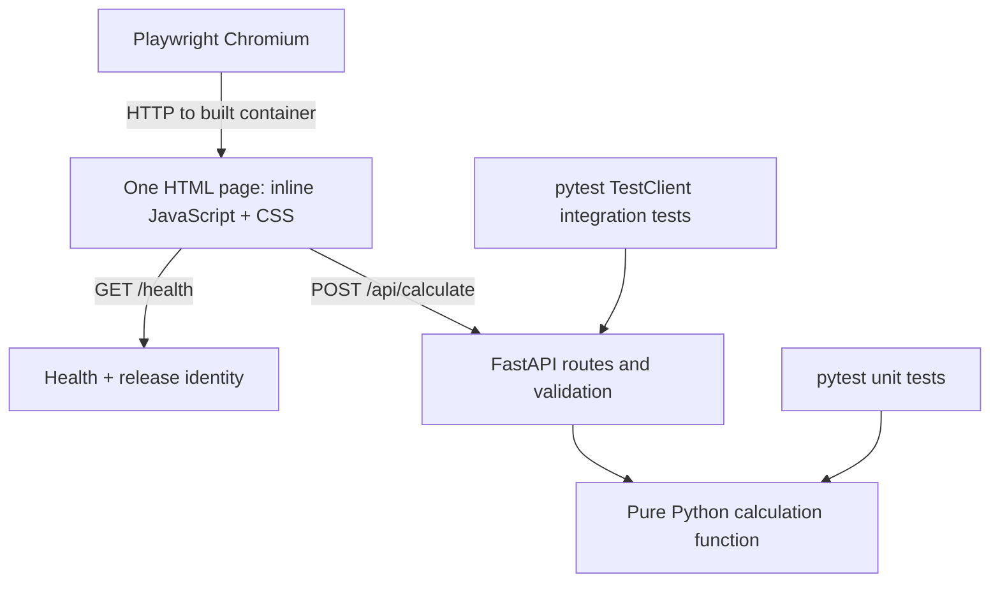

# Architecture and decisions

Status: implemented and rehearsed on 2026-09-17. See [evidence](evidence.md).

## Components



FastAPI serves the test homepage at `/`, the preserved calculator at `/calculator`, and the API from one origin, avoiding CORS configuration. Calculation logic has no dependency on HTTP, environment variables, or container runtime. The API layer translates validation and domain errors into the specified HTTP contract.

Release metadata is baked into `app/release.json` inside the image and exposed through `/health`. It is not stored in runtime environment variables that an updater could carry over from the old container. The development source mount hides this generated file and reports `local`.

Use Uvicorn in both environments: reload for development; a single process without reload for production. Use a maintained Python slim base image and pin dependency versions during implementation. Keep pytest, HTTPX test tooling, and browser binaries out of the production image. Playwright runs in CI tooling against the application container.

## Repository layout

The implementation follows this layout:

```text
app/
  main.py                 # Routes, request schema, release metadata
  calculator.py           # Pure Python arithmetic and domain validation
  index.html              # All frontend markup, CSS, and JavaScript
tests/
  unit/
  integration/
  e2e/
Dockerfile
compose.yaml
Makefile
pyproject.toml
uv.lock                   # Pinned complete dependency graph
.github/workflows/ci.yml
```

## Docker Compose services

| Service | Host mapping | Source of code | Lifecycle |
| --- | --- | --- | --- |
| `dev` | `127.0.0.1:8080` → container `8000` | Mounted local source | Uvicorn reload |
| `prod` | `127.0.0.1:8090` → container `8000` | Docker Hub image | Recreated after a passing release |
| `wud` | Optional `127.0.0.1:8091` dashboard | Pinned WUD image | Registry polling and production update |

Loopback binding is the verified default for this local classroom demo. Public access is an optional companion-owned overlay; see [hosting handoff](hosting.md). Production here means the release-built runtime. Map different host ports to the same internal application port.

One Compose file should support `make dev` before any production image exists, then `make up` once the first release is published. Development and production must not share a source-code volume. WUD needs Docker control access to recreate containers; mounting a Docker socket read-only does not make Docker API access read-only. Treat the updater as a privileged local component, keep its dashboard local, and do not expose the daemon over unauthenticated TCP.

WUD 9.0.2 uses its Docker container trigger for this project. Its Compose trigger matches literal image strings and rewrites the Compose file; our `prod` image is selected through an environment expression. The container trigger avoids reliance on that string matching and avoids mounting/writing the source tree. It recreates only the opted-in production container and retains its ports, network, health check, and runtime environment. Automatic replacement and Compose reconciliation were verified: production changed release while the development container ID remained unchanged. Compose may recreate production once to reconcile its labels after a WUD update; it retains the current release.

WUD requires authentication. `make up` generates a random local admin password in ignored `.state/wud.env` with mode `0600`; the dashboard is bound to `127.0.0.1:8091`. Credentials are never committed or printed by the commands. Open that local file yourself to log in as `admin`. Persistent WUD data lives in a named volume.

## Decisions already made

| Decision | Reason |
| --- | --- |
| FastAPI and one HTML file | Small application with no frontend compile step |
| JavaScript and Python both calculate | Makes browser/API integration visible |
| One Calculate button | One short E2E interaction covers the complete flow |
| pytest at both lower test levels | Consistent runner and clear test directory separation |
| Playwright Python, Chromium only | Real browser coverage with a narrow dependency set |
| Docker Hub and WUD | Demonstrates registry publication and host-side automatic deployment |
| Commit-tagged images plus `:prod` | Traceable releases with a simple deployment channel |
| No database | Keeps tests deterministic and the lesson focused |

## Verified environment decisions

- Deployment uses this Mac's Docker Desktop on `linux/arm64`, with services bound to loopback.
- The GitHub repository and `kaw393939/is373_ci_cd` Docker Hub repository are public.
- The initial demo used `ubuntu-24.04-arm` and a single ARM64 image. The current pipeline tests native AMD64 and ARM64 artifacts and publishes a combined index; see [CI/CD](ci-cd.md).
- Python is `3.13.15`; uv `0.12.15` bootstraps locally under ignored `.tools/`, with the full dependency graph committed in `uv.lock`.
- Python container base: `python:3.13.15-slim-bookworm`, pinned by digest in the Dockerfile.
- WUD selected release: `9.0.2`, pinned by digest in Compose.
- Docker Hub push permission was verified by successful Actions publication using the existing secret.
- Development runs on `8080`; the owner authorized stopping the previous Apache container `confident_mendel`, which remains intact.

## Local port resolution

The initial rehearsal used `8082` because `confident_mendel` occupied `8080`. The owner subsequently authorized stopping it. Final QA verified development on `8080`, production on `8090`, and WUD on `8091`; the port change left production running. [#19](https://github.com/kaw393939/is373_ci_cd/issues/19) records the resolution. To restore the old Apache container later, first free `8080`, then run `docker start confident_mendel`.

For the shortest demo use a single deployment architecture and a compatible CI runner where practical. If that is unavailable, explicitly choose emulation or multi-platform builds and record the build-time tradeoff. Browser-test the deployable architecture, or state clearly when only one architecture of a multi-platform release was tested. Never silently ship an AMD64-only image to an ARM64 host.

## Adaptation to other frameworks

Keep the image publication, tags, registry credentials, WUD policy, issue workflow, and release verification pattern. Replace the application, dependency setup, Dockerfile, and implementations of the commands in [CONTRIBUTING.md](../CONTRIBUTING.md). Retain a health route and release identity so the deployment lesson still works.

## References

- [FastAPI container deployment](https://fastapi.tiangolo.com/deployment/docker/)
- [WUD Docker Compose trigger](https://getwud.app/docs/configuration/triggers/docker-compose/)
- [WUD watchers and digest monitoring](https://getwud.app/docs/configuration/watchers/)

## Companion boundary

The hosting repository owns the external proxy network and public Host-rule overlay. This repository owns app lifecycle and loads a local `compose.override.yaml` consistently. Local loopback ports remain 8080/8090/8091, and only production is attached to public routing. See [the contract](hosting.md).
